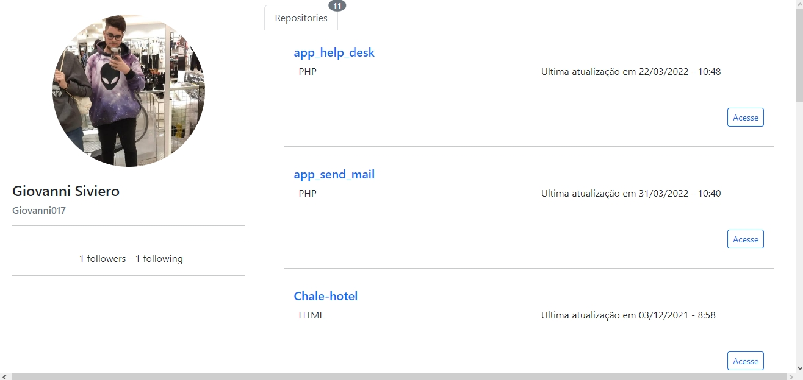
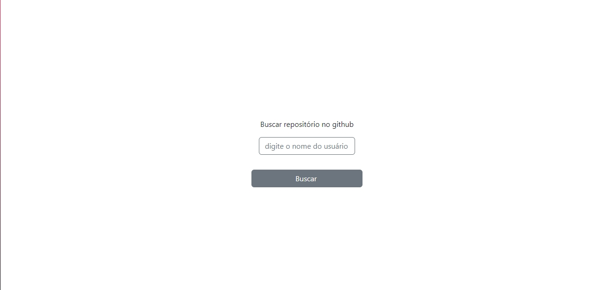
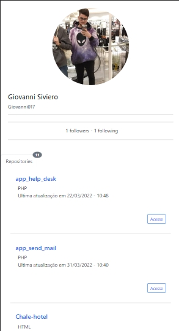
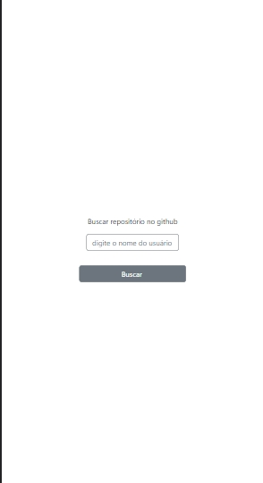

<h1 align="center">
    Desafio React
</h1>

<p align="center">
 <a href="#-sobre-o-projeto">Sobre</a> •
 <a href="#-funcionalidades">Funcionalidades</a> •
 <a href="#-layout">Layout</a> • 
 <a href="#-como-executar-o-projeto">Como executar</a> • 
 <a href="#-ferramentas">Ferramentas</a> • 
</p>


## 💻 Sobre o projeto

Desafio React - Desenvolver uma aplicação react que mostre o perfil do desenvolvedor e list os seus repositórios do github. Utilizar com base no create-react-app.

---

## ⚙️ Estruturação de pastas

- `src/Components` - Contém componentes
- `src/Pages` - Contém páginas do aplicativo
- `src/Router` - Contém todos as rotas da aplicação
- `src/Services` - Contém serviços e utilitários

---

## 🎨 Layout
### Web
<div align="center" style="display: flex; align-items: flex-start; justify-content: start;">
  
  
</div>

<br/>

### Mobile (responsivo)
<div align="center" style="display: flex; align-items: flex-start; justify-content: start;">
  
  
</div>


---

## 🚀 Como executar o projeto
### Pré-requisitos

Ter instalado em sua máquina as seguintes ferramentas:
[Git](https://git-scm.com), [Node.js](https://nodejs.org/en/). 
Editor utilizado [VSCode](https://code.visualstudio.com/)
<br/><br/>

#### 🧭 Rodando a aplicação

```bash

# Clone este repositório
https://github.com/Giovanni017/giovanni-desafio-react.git

# Acesse a pasta do projeto no terminal/cmd
$ cd giovanni-desafio-react

# Instale as dependências
$ npm install

# Execute a aplicação em modo de desenvolvimento
$ npm start

# O servidor inciará na porta:3000 - acesse http://localhost:3000 

```

---

## 🛠 Ferramentas

Ferramentas utilizadas: 

-   **[React Router Dom](https://github.com/ReactTraining/react-router/tree/master/packages/react-router-dom)**
-   **[Axios](https://github.com/axios/axios)**
-   **[Moment.js](https://momentjs.com/)**
-   **[Bootstrap](https://getbootstrap.com/)**
